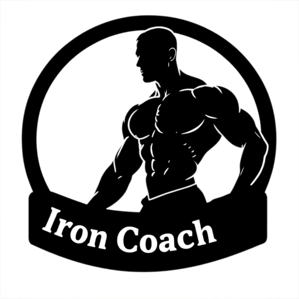

<h1>
  🏋️‍♂️ IronCoach
  
</h1>

> **Your Personal Fitness Companion** - A comprehensive fitness tracking and coaching application designed to help trainers manage their clients and trainees achieve their fitness goals.


[](https://golang.org/)
[](https://reactnative.dev/)
[](https://expo.dev/)
---

## 📚 Table of Contents

- [🌟 Features](#-features)
- [🛠️ Tech Stack](#-tech-stack)
- [📁 Project Structure](#-project-structure)
- [🚀 Quick Start](#-quick-start)
- [📱 API Documentation](#-api-documentation)
- [🧪 Testing](#-testing)
- [📦 Deployment](#-deployment)
- [🤝 Contributing](#-contributing)
- [👨‍💻 Authors](#-authors)
- [🙏 Acknowledgments](#-acknowledgments)
- [📞 Support](#-support)

---

## 🌟 Features

### For Trainers
- **👥 Client Management**: Comprehensive trainee profiles and progress tracking
- **📋 Workout Planning**: Create custom workout routines and exercise categories
- **📊 Progress Monitoring**: Visual analytics and progress reports
- **🍎 Diet Management**: Nutrition tracking and meal planning
- **📈 Performance Analytics**: Detailed insights into client performance

### For Trainees
- **🏃‍♂️ Workout Logging**: Easy-to-use workout tracking interface
- **📱 Mobile-First Design**: Optimized for on-the-go fitness tracking
- **🎯 Goal Setting**: Set and track personal fitness objectives
- **📊 Progress Visualization**: See your fitness journey at a glance
- **🥗 Nutrition Tracking**: Log meals and monitor dietary habits

## 🛠️ Tech Stack

### Backend (Go)
- **Framework**: Native Go HTTP server
- **Architecture**: Clean Architecture with layered structure
- **Database**: MongoDB/PostgreSQL (configurable)
- **Authentication**: JWT-based authentication
- **File Uploads**: Secure file handling and storage

### Frontend (React Native + Expo)
- **Framework**: React Native with Expo
- **Navigation**: React Navigation
- **State Management**: Context API
- **UI Components**: Custom themed components
- **TypeScript**: Full type safety
- **Testing**: Jest and React Native Testing Library

## 📁 Project Structure

```
ironcoach/
├── backend/                    # Go backend server
│   ├── cmd/                   # Application entry points
│   ├── controllers/           # HTTP request handlers
│   ├── models/               # Data models
│   ├── repositories/         # Data access layer
│   ├── services/             # Business logic layer
│   ├── routes/               # API route definitions
│   ├── middlewares/          # HTTP middlewares
│   ├── database/             # Database configuration
│   └── utils/                # Utility functions
│
└── frontend/                  # React Native mobile app
    ├── app/                  # Main application code
    │   ├── screens/          # Screen components
    │   ├── contexts/         # React contexts
    │   ├── navigation/       # Navigation configuration
    │   ├── types/            # TypeScript type definitions
    │   └── utils/            # Utility functions
    ├── components/           # Reusable UI components
    ├── constants/            # App constants and themes
    ├── hooks/                # Custom React hooks
    └── assets/               # Images, fonts, and static assets
```

## 🚀 Quick Start

### Prerequisites
Make sure you have the following installed:
- **Go** 1.19 or higher
- **Node.js** 16 or higher
- **npm** or **yarn**
- **Expo CLI** (`npm install -g @expo/cli`)
- **Git**

### Backend Setup

1. **Clone the repository**
   ```bash
   git clone https://github.com/yourusername/ironcoach.git
   cd ironcoach/backend
   ```

2. **Install dependencies**
   ```bash
   go mod download
   ```

3. **Environment configuration**
   ```bash
   cp .env.example .env
   # Edit .env with your database and configuration details
   ```

4. **Run the server**
   ```bash
   go run cmd/main.go
   ```

The backend server will start on `http://localhost:8080`

### Frontend Setup

1. **Navigate to frontend directory**
   ```bash
   cd ../frontend
   ```

2. **Install dependencies**
   ```bash
   npm install
   # or
   yarn install
   ```

3. **Start the development server**
   ```bash
   npx expo start
   ```

4. **Run on device/simulator**
   - Press `i` for iOS simulator
   - Press `a` for Android emulator
   - Scan QR code with Expo Go app for physical device

## 📱 API Documentation

### Authentication Endpoints
```
POST /api/auth/login          # User login
POST /api/auth/register       # User registration
POST /api/auth/refresh        # Token refresh
```

### Trainer Endpoints
```
GET    /api/trainers          # Get all trainers
POST   /api/trainers          # Create trainer
GET    /api/trainers/:id      # Get trainer by ID
PUT    /api/trainers/:id      # Update trainer
DELETE /api/trainers/:id      # Delete trainer
```

### Trainee Endpoints
```
GET    /api/trainees          # Get all trainees
POST   /api/trainees          # Create trainee
GET    /api/trainees/:id      # Get trainee by ID
PUT    /api/trainees/:id      # Update trainee
DELETE /api/trainees/:id      # Delete trainee
```

### Workout & Exercise Endpoints
```
GET    /api/categories        # Get workout categories
POST   /api/categories        # Create category
GET    /api/exercises         # Get exercises
POST   /api/exercises         # Create exercise
GET    /api/workout-logs      # Get workout logs
POST   /api/workout-logs      # Create workout log
```

### Diet & Nutrition Endpoints
```
GET    /api/diet-entries      # Get diet entries
POST   /api/diet-entries      # Create diet entry
PUT    /api/diet-entries/:id  # Update diet entry
DELETE /api/diet-entries/:id  # Delete diet entry
```

## 🧪 Testing

### Backend Tests
```bash
cd backend
go test ./...
```

### Frontend Tests
```bash
cd frontend
npm test
# or
yarn test
```

## 📦 Deployment

### Backend Deployment
```bash
# Build the application
go build -o bin/ironcoach cmd/main.go

# Run in production
./bin/ironcoach
```

### Frontend Deployment (Expo)
```bash
# Build for production
expo build:android
expo build:ios

# Or use EAS Build
eas build --platform all
```

## 🤝 Contributing

We welcome contributions! Please see our [Contributing Guidelines](CONTRIBUTING.md) for details.

1. **Fork the repository**
2. **Create your feature branch** (`git checkout -b feature/AmazingFeature`)
3. **Commit your changes** (`git commit -m 'Add some AmazingFeature'`)
4. **Push to the branch** (`git push origin feature/AmazingFeature`)
5. **Open a Pull Request**

## 👨‍💻 Authors

- **Vaibhav Bhardwaj** - *Initial work* - [@vaibhav07351](https://github.com/vaibhav07351)

## 🙏 Acknowledgments

- Thanks to all contributors who have helped me shape IronCoach
- Inspired by the fitness community and the need for better training tools
- Built with ❤️ for trainers and fitness enthusiasts

## 📞 Support

If you have any questions or need support, please:
- 📧 Email: vaibhav07351@gmail.com
---

<div align="center">
  <strong>🏋️‍♂️ Built for the fitness community, by the fitness community 🏋️‍♀️</strong>
</div>