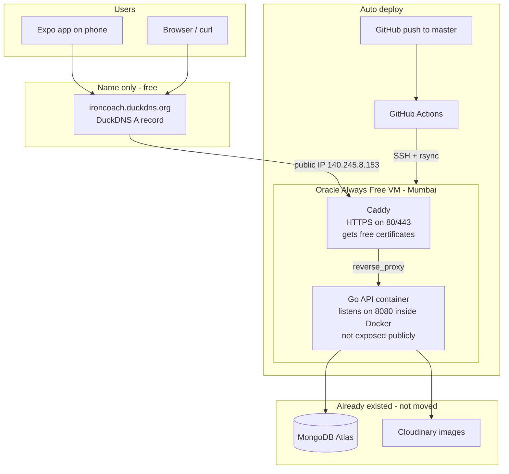
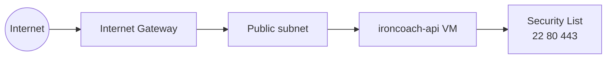
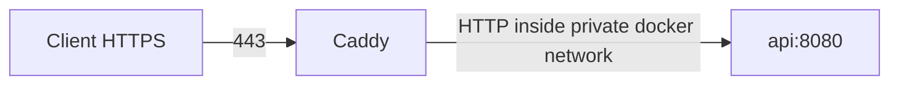
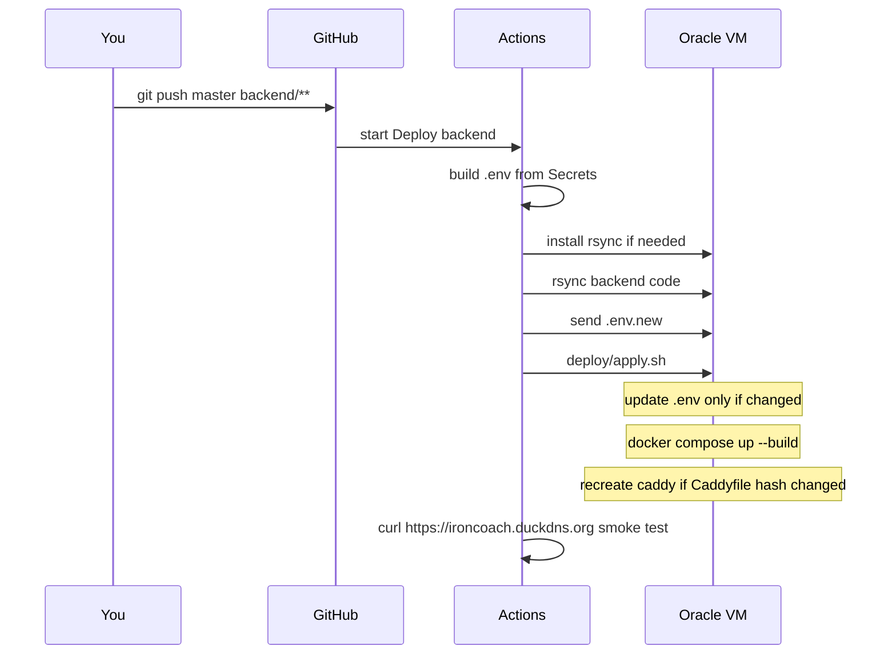

# IronCoach hosting from zero

A teaching guide for everything we set up: Oracle Cloud → Docker → Caddy → DuckDNS → GitHub Actions.

**Audience:** you (or anyone you teach) with little or no cloud experience.  
**Goal:** understand *what* each piece is, *why* we needed it, *what we selected*, what else existed, and how to repeat this for **any** similar project.

---

## How to use this doc

1. Read **Part A** for the big picture (10 minutes).
2. Walk **Part B** in order — that is the real story of what we did.
3. Use **Part C** when you deploy another app.
4. Use the **glossary** when a word feels fuzzy.

You do not need to memorize commands. You need to remember the *roles*: DNS name → firewall → VM → containers → reverse proxy → database allowlist → auto-deploy.

---

## Part A — Big picture

### What problem were we solving?

The Expo app talks to a **backend API** (Go + Gin). That API used to run on an **AWS EC2** machine at `ironcoach.duckdns.org`. That EC2 instance ended. The app still expected:

```text
https://ironcoach.duckdns.org
```

So we needed a **new always-on computer on the internet**, free if possible, that:

1. Runs our Go API 24/7  
2. Speaks HTTPS (secure)  
3. Can reach MongoDB Atlas and Cloudinary  
4. Can be updated when we change code  

### The stack in one diagram



### Mental model: layers

Think of a restaurant:

| Layer | Analogy | In our project |
|-------|---------|----------------|
| Domain name | Shop sign with street address | DuckDNS → IP |
| Firewall | Bouncer: which doors open | Oracle Security List ports 22, 80, 443 |
| VM | The building | Oracle Ampere Ubuntu server |
| Docker | Rooms inside the building | `api` and `caddy` containers |
| Caddy | Front desk / receptionist | HTTPS + forward to API |
| Go API | Kitchen that cooks orders | Gin REST API |
| Atlas / Cloudinary | Suppliers outside | Database + images |
| GitHub Actions | Delivery truck bringing new recipes | Auto deploy on push |

If you change only the kitchen recipe (code), you rebuild the API room.  
If you change the sign’s address (DNS), traffic goes elsewhere.  
If the bouncer blocks HTTPS, customers cannot enter even if the kitchen is fine.

---

## Part B — Step by step: what we did and why

### 1. Why Oracle Cloud (not Fly.io, Koyeb, Render, another EC2)?

| Option | Free forever? | Always awake? | Many projects on one box? | Why we chose / skipped |
|--------|---------------|---------------|---------------------------|-------------------------|
| **Oracle Always Free** | Yes (Always Free shapes) | Yes | **Yes** — one VM, many apps | Best for “free + fast + future projects” |
| Fly.io | No (trial only now) | Paid | Per-app billing | You correctly rejected this |
| Koyeb free | 1 free service | Yes | **No** — one free app slot | Bad if you want many projects |
| Render free | Yes | **No** — sleeps → cold start | Limited | Slow after idle |
| AWS EC2 free tier | Mostly 12 months | Yes | Yes | Your old host; free tier ended |

**Teaching point:** “Free PaaS” often means *one small slot* or *sleeps when idle*. A free **VM** is like owning a small PC in a data center: more work, more control, many apps.

**Limits that matter for IronCoach (not Oracle):**

- **MongoDB Atlas Free** (~512 MB) — usually the real user-count ceiling  
- **Cloudinary Free** — photo uploads  
- Oracle VM (1 OCPU / 6 GB) is *plenty* for this API size  

---

### 2. Oracle signup: home region

**What it is:** Your account’s permanent “home city” for Always Free compute.

**What we selected:** **India West (Mumbai)** — `ap-mumbai-1`

**Why:**

- You are in India → lower latency  
- Always Free VMs must be in the **home region**  
- **You cannot change home region later**

**Alternatives we considered:**

| Choice | Meaning | Impact |
|--------|---------|--------|
| Mumbai | Closest for IN users | Best for you |
| Hyderabad | Also India | Fine backup if Mumbai signup failed |
| Singapore / US | Farther | Higher latency; still works |

**Also at signup:** card for identity check; **$300 trial credits** are separate from Always Free. For **$0 forever**, only create Always Free–eligible shapes (do not casually launch paid GPUs/big VMs during trial).

---

### 3. Networking: VCN, subnet, security list

#### What is a VCN?

**Virtual Cloud Network** = private network inside Oracle for your resources (like a private LAN in the cloud).

**What we created:** `ironcoach-vcn` via wizard **“VCN with Internet Connectivity”**

That wizard also created:

- Public subnet (`ironcoach-public-subnet`)  
- Internet Gateway (path out to / in from the internet)  
- Route table + default security list  

**Why we needed it:** A VM with only a private IP cannot serve `https://ironcoach.duckdns.org` to phones. It needs a **public subnet + public IP + open ports**.



#### Security list (firewall) — what we opened

Already there:

- **TCP 22** — SSH (you administer the machine)  
- Some ICMP — network diagnostics (leave it)

We added:

| Port | Protocol | Source | Why |
|------|----------|--------|-----|
| **80** | TCP | `0.0.0.0/0` | HTTP — Let’s Encrypt + redirect to HTTPS |
| **443** | TCP | `0.0.0.0/0` | HTTPS — real app traffic |

**What we did *not* open:**

| Port | Why not |
|------|---------|
| **8080** | Go listens on 8080 *inside* Docker only. Public world talks to Caddy on 443. Fewer attack surfaces. |

**`0.0.0.0/0` means:** anyone on the internet. Needed for a public API. For SSH, lock to your home IP later if you want tighter security (optional).

**Stateless vs stateful:** we left rules **stateful** (default). That is correct for beginners; Oracle tracks return traffic for you.

---

### 4. The VM: image, shape, placement

#### Instance name

`ironcoach-api` — label only. Could be anything.

#### Image (OS)

**Selected:** Canonical Ubuntu **22.04 Minimal aarch64** (you landed on 22.04; 24.04 Minimal aarch64 was also fine)

**Why `aarch64`?**  
Oracle **Ampere A1** CPUs are **ARM**. x86 Ubuntu images will not run correctly on Ampere.

| Image type | CPU | Use with |
|------------|-----|----------|
| Ubuntu … aarch64 | ARM | **Ampere A1** |
| Ubuntu (no aarch64) | x86 | AMD micro / Intel |
| “Minimal” | Smaller package set | Fine for Docker servers |

#### Shape (CPU / RAM)

**Selected:** `VM.Standard.A1.Flex` — **Always Free-eligible** — **1 OCPU / 6 GB RAM**

| Choice | Meaning | Impact |
|--------|---------|--------|
| Ampere A1 Flex | ARM flexible size | Free tier hero shape |
| 1 OCPU / 6 GB | Half (or part) of free ARM pool | Enough for API + Caddy + future small apps |
| 2 OCPU / 12 GB | Larger free allocation (docs vary by era) | More headroom; harder to get capacity |
| AMD `E2.1.Micro` | Tiny x86 Always Free | Emergency if Ampere out of capacity; only 1 GB RAM |
| Paid Intel/AMD Flex | Not free | Costs money — avoid for your goal |

**Capacity error (`Out of capacity`):** Mumbai has **one** AD. Ampere free hosts are popular. Retry later — not a misconfiguration.

**“Too many requests”:** Oracle rate-limited rapid Create clicks. Wait, then try once.

#### Networking on the VM form

| Setting | Value | Why |
|---------|-------|-----|
| Existing VCN | `ironcoach-vcn` | Use the network we prepared |
| Public subnet | yes | Reachable from internet |
| Assign public IPv4 | **yes** | Without this, no SSH/HTTPS from outside |
| IPv6 | off | VCN wasn’t IPv6-enabled; not needed |

#### SSH keys

**What:** Cryptographic key pair. Public key on server, private key on your PC. Password login is disabled by default — good.

**Selected:** Generate key pair → save `ssh-key-….key` locally.

**Windows gotcha:** OpenSSH refuses keys that are readable by “everyone”. Fix with `icacls` so **only your user** can read the key.

**Username:** `ubuntu` for Canonical Ubuntu images.

**Your public IP:** `140.245.8.153` (can change if you replace the VM — then update DuckDNS + Atlas).

---

### 5. DuckDNS — the friendly name

**What:** Free dynamic DNS. Maps a name → IP.

**Ours:** `ironcoach.duckdns.org` → `140.245.8.153`

**Why keep the same name?**  
Frontend `app.json` already has `backendUrl: https://ironcoach.duckdns.org`. Changing the name means rebuilding/configuring the app. Changing only the **IP behind** the name is invisible to the app.

**DuckDNS is not hosting.** It is only a pointer. Hosting is Oracle.

```text
Before: ironcoach.duckdns.org  →  old AWS IP
After:  ironcoach.duckdns.org  →  140.245.8.153 (Oracle)
```

---

### 6. MongoDB Atlas Network Access

**What:** Atlas only accepts connections from allowed IPs (unless you allow `0.0.0.0/0`).

**What we added:** `140.245.8.153/32` (exactly the VM)

**Why:** The API runs *on the VM*, so Mongo sees connections **from the VM’s public IP**, not from your laptop.

**`/32` means:** single IP.

**If you recreate the VM and get a new IP:** update Atlas (and DuckDNS) or the API will fail with connection errors even if the app “looks fine.”

We did **not** move the database to Oracle. Atlas stays; only the API moved.

---

### 7. Why Docker?

**Without Docker:** install Go on Ubuntu, systemd service, manual upgrades, “works on my machine” drift.

**With Docker:**

- Same recipe every time (`Dockerfile`)  
- Isolated process  
- Easy rebuild on deploy  
- Match what CI will run  

**What we run:**

| Container | Role |
|-----------|------|
| `api` | Built from our Go code; port **8080 inside** the Docker network |
| `caddy` | Public **80/443**; proxies to `api:8080` |



**Compose** (`docker-compose.yml`): one file that starts both, restart policy, env file, volumes for Caddy certificates.

**`ENV=production`:** our Go code skips reading a `.env` *file* inside the process; Compose still **injects** variables from `.env` into the container environment. So secrets work without baking them into the image.

---

### 8. Why Caddy (not nginx, not exposing 8080)?

| Need | Caddy’s job |
|------|-------------|
| HTTPS | Automatic Let’s Encrypt certificates for `ironcoach.duckdns.org` |
| Reverse proxy | Forward traffic to Go |
| Simple config | Our `Caddyfile` is a few lines |

**Why not expose Go on 8080 publicly?**

- No automatic HTTPS on raw Gin without more code  
- Bots scan open ports; one public HTTPS entrypoint is cleaner  

**Caddyfile idea:**

```text
ironcoach.duckdns.org {
    reverse_proxy api:8080
}
```

`api` is the **Docker service name** (DNS inside the compose network), not the public hostname.

**Certificates:** stored in Docker volume `caddy_data` so they survive container restarts.

---

### 9. First deploy: why copy all files once?

The blank VM had Docker but **no** project code. First time we `scp`’d `backend/` so we could `docker compose up --build`.

That was a **bootstrap**. It is not the long-term workflow.

**Long-term:** GitHub Actions on every push (see next section).

---

### 10. GitHub Actions auto-deploy



#### Repository secrets (why not “one big secret”)

GitHub’s form is **one Name + one Secret per entry**. You create many secrets. The workflow reads each by name.

| Secret group | Purpose |
|--------------|---------|
| `ORACLE_HOST` / `ORACLE_USER` / `ORACLE_SSH_PRIVATE_KEY` | Actions can SSH like you do |
| `MONGODB_URI`, `JWT_SECRET`, Cloudinary, Google IDs | Rebuild production `.env` without committing secrets |

**Never commit `.env` to git.** Secrets live in GitHub + on the server.

#### Env-only changes

Changing a secret does **not** auto-run deploy. Secrets are read when a workflow **runs**.

- Code change → `git push` → deploy  
- Env only → edit secret → **Actions → Deploy backend → Run workflow**  

`apply.sh` compares new vs old `.env` and only recreates the API if content changed.

#### Why install `rsync` on the VM?

Ubuntu **Minimal** is stripped down. `rsync` must exist on **both** sides. First deploy installs it if missing.

#### Branch name

Your repo default is **`master`**. Workflow also listens to **`main`**. Push to whichever you use.

---

### 11. Bots hitting `/.env` in logs

Right after going public, scanners probe common secret paths. You saw **404** / **429**. That means:

- They did **not** get your secrets  
- Rate limiting works  
- Normal for any public IP  

Do not panic; do not open extra ports.

---

## Part C — Do this for another unrelated project

Checklist you can teach:

1. **Where does the app run?** Need a VM or a PaaS?  
2. **Free + always on + multiple apps?** → Oracle Always Free VM (or similar).  
3. **Home region** near users; permanent.  
4. **VCN + public subnet + public IP.**  
5. **Firewall:** SSH + whatever the public entry needs (usually 80/443).  
6. **Image matches CPU** (ARM vs x86).  
7. **Point DNS** at the public IP.  
8. **Allowlist the VM IP** on managed DBs.  
9. **Containers:** app + reverse proxy with HTTPS.  
10. **CI:** push → SSH → sync → rebuild.  
11. **Secrets:** CI secrets / server `.env`, never git.

### Scenario variants

| Scenario | Change from IronCoach |
|----------|------------------------|
| Node/Python API | Different Dockerfile; same Caddy + Compose pattern |
| Multiple domains on one VM | Multiple site blocks in Caddyfile / more compose services |
| Static website only | Caddy or nginx serving files; maybe no API container |
| Database on the VM | Possible but more ops; we kept Atlas managed |
| Private API (not public) | No 80/443 from `0.0.0.0/0`; VPN or IP allowlist |

---

## Day-to-day cheat sheet

### Is it up?

```powershell
curl.exe -sS https://ironcoach.duckdns.org/
```

### Logs on server

```powershell
ssh -i "D:\Project Apps\ironcoach\Resources\ssh-key-2026-09-22.key" ubuntu@140.245.8.153
```

```bash
cd ~/ironcoach-backend
docker compose ps
docker compose logs -f api
```

### Deploy code

```bash
git push origin master
```

Watch: GitHub → Actions → Deploy backend.

### Deploy env only

Edit repository secret → Actions → Deploy backend → **Run workflow**.

---

## Glossary

| Term | Plain meaning |
|------|----------------|
| **VM** | Virtual computer in the cloud |
| **Always Free** | Oracle resources that stay free if you stay in free shapes/limits |
| **OCPU** | Oracle’s CPU unit (Ampere cores) |
| **VCN** | Your private cloud network |
| **Security list** | Firewall rules for the subnet |
| **Public IP** | Address reachable from the internet |
| **SSH** | Encrypted remote terminal |
| **DNS / DuckDNS** | Name → IP mapping |
| **Docker image** | Packaged app filesystem + metadata |
| **Container** | Running instance of an image |
| **Compose** | Multi-container definition file |
| **Reverse proxy** | Receives public traffic, forwards to app |
| **Let’s Encrypt** | Free TLS certificates (Caddy obtains them) |
| **Atlas Network Access** | IP allowlist for MongoDB |
| **GitHub Actions** | CI/CD runners triggered by git events |
| **Repository secret** | Encrypted config for Actions |

---

## What we deliberately did *not* do

- Move MongoDB onto Oracle (kept Atlas)  
- Pay for Fly/Render/AWS just to host this API  
- Expose port 8080 publicly  
- Put `.env` in git  
- Use Oracle Autonomous DB (wrong fit; we already have Mongo)  

---

## Teaching test (check your understanding)

Try answering without scrolling up:

1. Why does the phone not talk to port 8080?  
2. Why must Atlas allow `140.245.8.153`?  
3. Why `aarch64` Ubuntu?  
4. What happens if DuckDNS still points at the old AWS IP?  
5. Why doesn’t editing a GitHub secret alone update the server?  

If you can teach those five answers clearly, you own this setup.

---

## File map (where things live)

| Path | Purpose |
|------|---------|
| `backend/Dockerfile` | How to build the Go API image |
| `backend/docker-compose.yml` | api + caddy together |
| `backend/Caddyfile` | Domain → proxy rules |
| `backend/deploy/apply.sh` | Server-side smart deploy |
| `backend/deploy/README.md` | Short ops runbook |
| `.github/workflows/deploy-backend.yml` | Push-to-deploy pipeline |
| This file | Deep understanding / teaching |

---

*Written for the IronCoach Oracle migration (Mumbai Always Free Ampere VM + DuckDNS + Atlas + Docker/Caddy + GitHub Actions). Reuse the mental model; swap the app-specific parts for your next project.*
